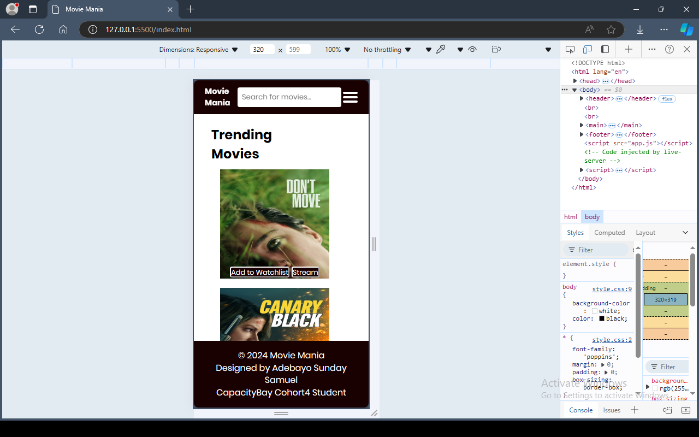
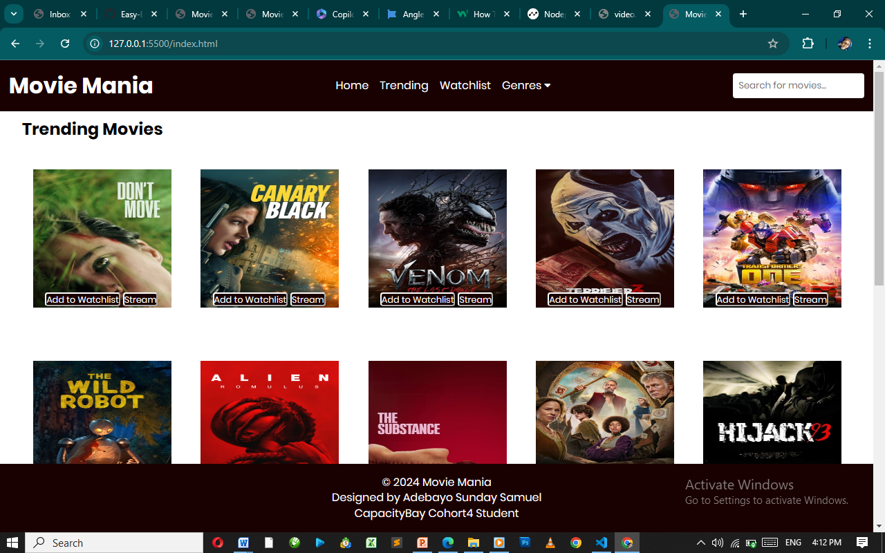
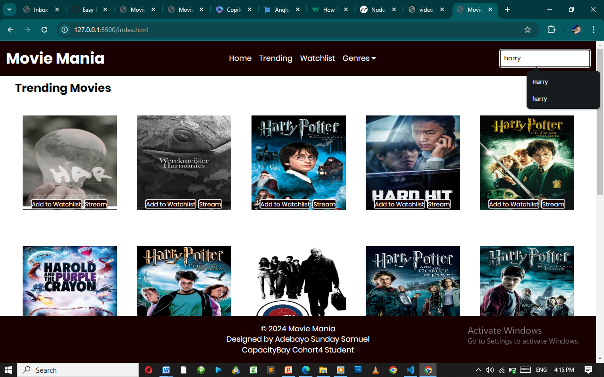

# Final-Javascript-Assignment
is a responsive web application that allows users to explore movies, search for their
favorites, view detailed information, and create a personalized watchlist. The app leverages public
movie APIs to fetch and display data dynamically.

# Features and Functionality
Fetching Data: The {fetchTrendingMovies} function fetches data from the provided API and calls displayMovies to render the movies.

Search Functionality: The {searchMovies} function fetches data based on the search query and updates the movie display.

Displaying Movies: The displayMovies function dynamically creates movie elements and appends them to the specified container.

Watchlist Management: Functions addToWatchlist, displayWatchlist, and removeFromWatchlist handle adding, displaying, and removing movies from the watchlist using local storage.

Error Handling: The displayError function shows an error message if the API request fails.

Search Input: An event listener on the search input field triggers the search functionality

# API USED
TMDb API: TMdb APi was Used to fetch movie data.
const API_KEY = '8d85e791b741b0217b3ac82182b8803a'; 
const TRENDING_API_URL = `https://api.themoviedb.org/3/trending/movie/day?api_key=${API_KEY}`;
const SEARCH_API_URL = `https://api.themoviedb.org/3/search/movie?api_key=${API_KEY}&query=`;
const GENRE_API_URL = `https://api.themoviedb.org/3/genre/movie/list?api_key=${API_KEY}`;

Note: The API does not allow Snippet and Trailers.

